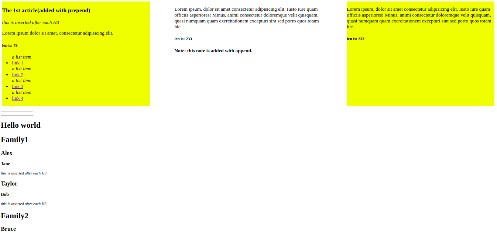

# Gomycode fullstack JS project.

### this project is part of the [the Gomycode.tn](https://gomycode.tn) fullstack JS bootcamp program.

## User Stories

1. <strong>User Story:</strong> The user can change the page's content by typing in the input field.

    

# What did I learn:

1. Intro to the DOM and to Jquery.

2. Jquery Basics.

3. DOM manipulation.
